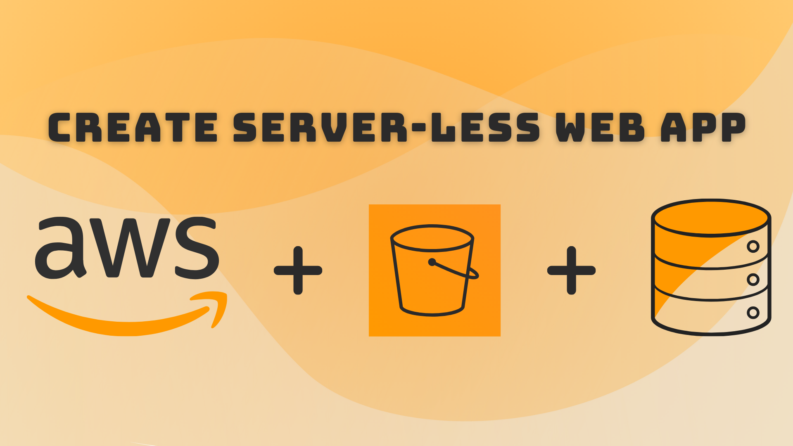

# JSON Payload in RESTful API

## >> Getting started



To get started with this project, run

```bash
git clone https://github.com/Vishakha-Sawra/aws-serverless-app
```

## >> Navigate to lambda-function and install dependencies:

```bash
cd lambda-function
npm install
```

## >> Create AWS S3 bucket and several AWS services: 

1. Follow the documentation:

https://fewv.dev/lessons/create-aws-serverless-app/